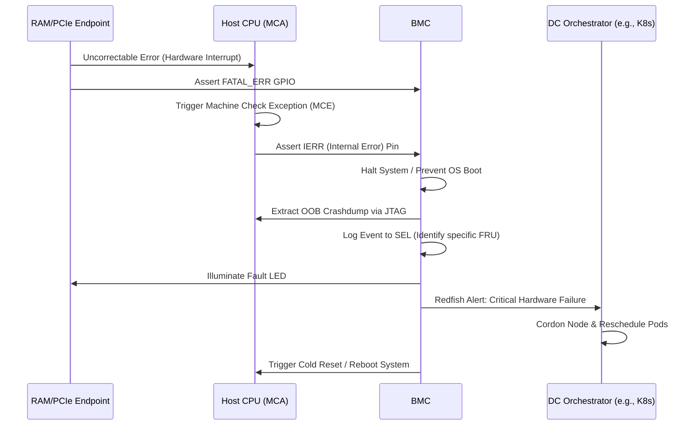

# Data Center RAS (Reliability, Availability, Serviceability) Architecture

## 1. Architectural Overview
RAS (Reliability, Availability, Serviceability) encompasses the hardware and firmware mechanisms designed to prevent silent data corruption, maximize node uptime, and streamline hardware replacement. In modern data center architectures, the **Baseboard Management Controller (BMC)** functions as the central clearinghouse for RAS telemetry, aggregating hardware faults out-of-band (OOB) independently of the host operating system.

## 2. Reliability: Error Detection and Containment
The BMC monitors isolated hardware subsystems to detect and contain faults before they propagate through the data plane.

### 2.1. Memory Error Handling
- **Correctable Errors (CE)**: Single-bit errors corrected by ECC. The BMC polls memory controllers via SMBus/I3C to read error counters.
- **Uncorrectable Errors (UE)**: Multi-bit errors. Triggers an immediate hardware interrupt (e.g., `SMI` or `NMI` to the host, and a dedicated GPIO assertion like `FATAL_ERR` to the BMC). To prevent data corruption, the host or BMC asserts a hard reset if the error is uncontainable (e.g., in kernel space).

### 2.2. PCIe Advanced Error Reporting (AER)
Transport and link-layer errors on PCIe topologies (GPUs, SmartNICs, NVMe) are logged via AER registers. 
- **Fatal AER**: Triggers an immediate interconnect reset. The BMC captures the failing endpoint's BDF (Bus/Device/Function) out-of-band to log the exact failing lane.
- **Non-Fatal AER**: The BMC tracks link degradation, potentially triggering automated link retraining.

### 2.3. Machine Check Architecture (MCA)
For x86 and ARM processors, hardware exceptions manifest as Machine Check Exceptions (MCE). 
- If a catastrophic error occurs (e.g., CPU core lockup), the CPU asserts the `IERR` (Internal Error) or `MCERR` pin. 
- The BMC detects this pin assertion and initiates a predefined crashdump sequence.

## 3. Availability: Uptime Maximization
Availability focuses on automated recovery and proactive mitigation of failing silicon.

### 3.1. Predictive Failure Analysis (PFA)
The BMC implements "leaky bucket" algorithms for corrected errors. If a specific memory DIMM or GPU HBM stack exceeds a threshold of corrected ECC errors within a time window, the BMC asserts a PFA alert. 
- The BMC exposes this telemetry via **Redfish APIs**.
- Cluster orchestrators (e.g., Kubernetes) consume this telemetry to gracefully live-migrate workloads and cordon the node, preventing an inevitable uncorrected error from causing a service outage.

### 3.2. Hardware Watchdog Timers
The BMC maintains multiple hardware watchdog timers:
- **BIOS/UEFI Watchdog**: Ensures the system doesn't hang during POST.
- **OS Watchdog**: Periodically pinged by an IPMI/OOB daemon in the host OS. If the kernel panics and stops pinging, the BMC automatically issues a cold reset to recover the node.

## 4. Serviceability: Diagnostics and Post-Mortem
Serviceability ensures that when hardware fails, the root cause is captured and the physical repair process is unambiguous.

### 4.1. Out-of-Band Crashdump (OBCD)
When a fatal error hangs the host data plane, in-band kernel crashdumps (like `kdump`) cannot execute. 
- The BMC halts the CPUs via sideband interfaces (e.g., JTAG, PECI, or I2C).
- It extracts architectural states, Machine Check registers, and uncore IP states.
- The dump is compressed and stored in the BMC's NVRAM or streamed over the management network for remote debugging.

### 4.2. Fault Isolation and FRU Management
- **System Event Log (SEL)**: The BMC logs the exact Field Replaceable Unit (FRU) that failed by cross-referencing the fault (e.g., CPU 0, Channel B, DIMM 1) with the I2C EEPROM FRU inventory.
- **Locator LEDs**: The BMC illuminates the specific component's amber fault LED and the chassis-level ID LED, guiding physical technicians directly to the failing part.

## 5. RAS Event Flow: Uncorrectable Error Scenario

