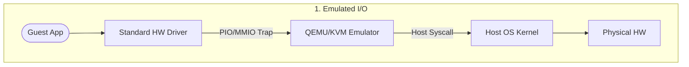
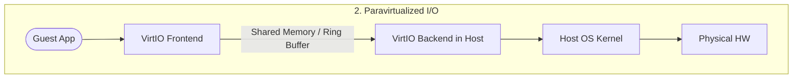
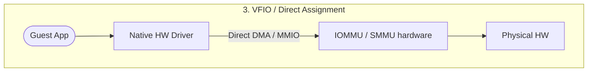
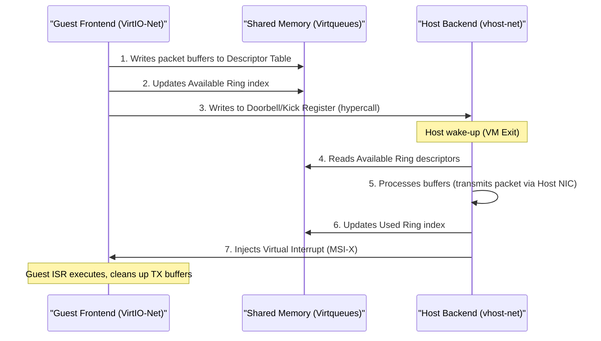
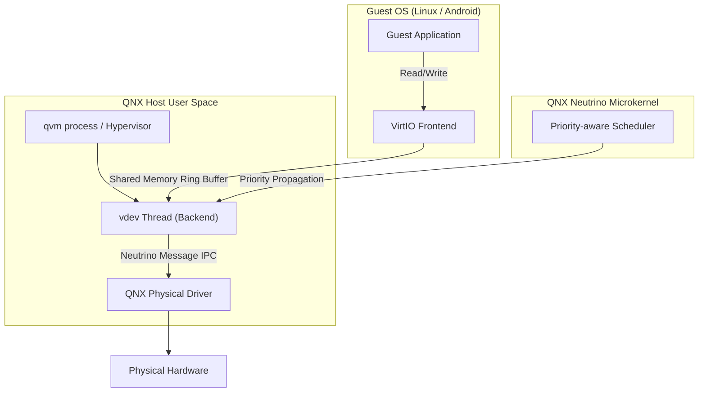

# Linux I/O Virtualization Architectures

This document details the design, mechanisms, and architectural trade-offs of the primary I/O virtualization techniques in Linux: Software Emulation, Paravirtualization (VirtIO), and Hardware-Assisted Pass-through (VFIO/SR-IOV).

---

## 1. Introduction to I/O Virtualization

I/O virtualization dictates how virtual machines (VMs) access physical network interface cards (NICs), storage controllers, and GPUs. In a virtualized system, we must map guest driver commands to the underlying host hardware while maintaining strict isolation and performance.

---

## 2. Software-Emulated I/O

Software emulation is the legacy model of I/O virtualization. The guest OS runs unmodified, loading native drivers for a standard piece of hardware that does not physically exist on the host (e.g., QEMU emulating an Intel e1000 NIC or an IDE storage controller).

### 2.1. Mechanism
1. **Instruction Capture:** When the guest driver reads or writes to memory-mapped I/O (MMIO) registers or Port I/O (PIO) space, the hardware CPU execution unit detects a privilege violation.
2. **VM Exit:** The CPU intercepts the operation and suspends the guest, triggering a VM Exit.
3. **Context Switch:** Control is handed back to KVM in the host kernel, which passes the request to the user-space device emulator (QEMU).
4. **Software Emulation:** QEMU mimics the state changes of the target hardware's registers, executes the transfer using host system calls, updates the emulated device state, and resumes guest execution.

### 2.2. VM Exit Overhead Analysis
For a single packet transmission in an emulated network card, the guest driver might write to the TX ring doorbell register, update descriptor registers, and read status registers. This causes **multiple VM Exits per packet**.
* **CPU Pipeline Flushes:** A VM Exit flushes the guest CPU pipelines.
* **Cache Pollution:** The context switch from Guest to Host Mode pollutes L1/L2 data and instruction caches, raising CPU overhead and lowering throughput.

---

## 3. Paravirtualized I/O (VirtIO)

Paravirtualization bypasses hardware register emulation. The guest OS is modified ("virtualization-aware") and runs a specialized **Frontend Driver** that communicates directly with a **Backend Driver** in the host (QEMU or vhost in the host kernel) via shared memory.

### 3.1. Architecture and Virtqueues
The core of the VirtIO standard is the **Virtqueue**. Virtqueues are implemented as shared-memory ring buffers consisting of three distinct structures:

1.  **Descriptor Table:** An array of descriptors containing guest physical addresses, lengths, and flags (read-only, write-only, chainable next buffers) pointing to raw data packets.
2.  **Available Ring:** An array of indices into the descriptor table representing buffers written by the guest frontend that are ready for the host backend to process.
3.  **Used Ring:** An array of indices representing buffers that the host backend has finished reading or writing.

### 3.2. Doorbell and Notification Batching
To avoid VM exits for every single transaction:
* **Host Kick (Doorbell):** When the guest writes to a designated MMIO register (the doorbell) to alert the host, it can batch requests. If the queue is already active, the guest writes to the queue without issuing a hypercall.
* **Guest Interrupts:** The host can suppress interrupts if it knows the guest is currently polling the used ring, minimizing context switches in both directions.

---

## 4. Hardware-Assisted Pass-through (Direct I/O)

To achieve near-native bare-metal performance, devices are mapped directly into the guest VM's physical address space.

### 4.1. IOMMU and Memory Translation (SMMU/VT-d)
In non-virtualized systems, devices perform DMA using Host Physical Addresses (HPA). In a VM, drivers program devices using Guest Physical Addresses (GPA). 
Without virtualization-aware hardware, a DMA write by a guest driver could corrupt host memory.

The **IOMMU** (Input-Output Memory Management Unit; e.g., Intel VT-d, AMD-Vi, or ARM SMMU) solves this:
* **Translation:** The IOMMU translates DMA requests from the device's Guest Physical Address (GPA) to Host Physical Address (HPA) using translation page tables.
* **Isolation:** The IOMMU restricts DMA access based on Peripheral Component Interconnect (PCI) Requestor IDs (Bus/Device/Function), preventing a compromised VM from accessing another VM's or the host kernel's memory space.

### 4.2. VFIO (Virtual Function I/O) in Linux
VFIO is a framework in the Linux kernel that exposes raw hardware device access directly to user-space applications (such as QEMU).
* **Safe Device Access:** VFIO wraps device access within IOMMU groups. An entire group of interdependent PCIe devices must be assigned to QEMU to ensure isolation.
* **MMIO Remapping:** VFIO exposes device MMIO regions via file descriptors that QEMU maps into the guest VM's address space using `mmap()`.
* **Interrupt Mapping:** Physical interrupts are routed directly to the guest using eventfd-backed virtualized MSI/MSI-X.

### 4.3. SR-IOV (Single Root I/O Virtualization)
Pass-through limits a device to a single VM. **SR-IOV** solves this by splitting a single physical PCIe device into multiple logical entities at the hardware level:
* **Physical Function (PF):** The primary PCIe function containing full configuration capabilities, used by the host to manage the device.
* **Virtual Functions (VF):** Lightweight, independent PCIe functions sharing physical resources (such as the network port) but exposing separate configuration spaces. Each VF has its own Requester ID, allowing the IOMMU to map individual VFs to different guest VMs independently.

---

## 5. Architectural Comparison

| Feature | Emulated I/O | Paravirtualized (VirtIO) | Pass-through (VFIO / SR-IOV) |
| :--- | :--- | :--- | :--- |
| **Performance (Throughput)** | Low | High (near-native) | Native / Bare-metal |
| **CPU Overhead** | High (frequent VM exits) | Moderate (batched notification) | Negligible |
| **Guest OS Modification** | None (runs legacy drivers) | Required (requires VirtIO drivers)| None (runs native HW drivers) |
| **VM Migration Support** | Excellent (software state) | Excellent | Hard (requires hardware state export or teaming/bonding) |
| **Hardware Dependency** | None | None | Requires IOMMU and SR-IOV support |
| **Hardware Sharing** | Shared in software (host) | Shared in software (host) | Shared in hardware (SR-IOV) |

---

## 6. I/O Virtualization in QNX and Real-Time Linux

In safety-critical and real-time domains (e.g., ADAS, automotive cockpits, industrial robotics), I/O virtualization must guarantee **determinism** and **bounded latency**. 

### 6.1. Real-Time Virtualization Constraints
Standard virtualization prioritizes throughput over latency, leading to major real-time problems:
*   **Virtual Interrupt Latency Jitter:** The time delay between a physical hardware interrupt arriving at the host and the virtual interrupt being injected into the guest VM varies dynamically.
*   **Priority Inversion:** High-priority guest threads can be blocked waiting for virtualized shared resources if the host helper thread (e.g., backend emulator) runs at a lower priority.
*   **VM Exit Interrupt Overheads:** Context switching (VM exits) to handle I/O operations introduces unpredictable scheduling pauses.

### 6.2. QNX Hypervisor I/O Virtualization
The QNX Hypervisor is built on the **QNX Neutrino Microkernel**. In QNX, the virtualization layer is highly modular because QNX runs device drivers, filesystems, and the hypervisor backend itself in **user space** as separate processes.

*   **Virtual Devices (vdevs) and Priority Inheritance:** When a guest VM frontend driver triggers an I/O operation via shared memory, a backend thread in QNX (`vdev` handler) processes the request. To prevent priority inversion, QNX allows the priority of the guest thread executing the I/O operation to be mapped and propagated to the host `vdev` thread handling the request.
*   **SMMU-isolated Direct Pass-through:** For safety-critical functions (e.g., ASIL-D camera feed rendering or CAN bus interfaces), QNX configures direct hardware pass-through. The hardware platform's **System Memory Management Unit (SMMU)** (the ARM equivalent of IOMMU) is programmed to isolate the memory ranges of passed-through peripherals. The guest VM is granted direct access to physical peripheral MMIO registers without hypervisor interception.

### 6.3. Real-Time Linux (PREEMPT_RT + KVM) I/O Virtualization
Real-Time Linux converts the standard monolithic Linux kernel into a hard real-time operating system using the `PREEMPT_RT` patch. When combined with KVM, Linux functions as a **Real-Time Hypervisor**.

*   **Mitigating Latency Jitter in RT-KVM:**
    *   **vCPU Thread Scheduling:** Guest vCPU threads are assigned to real-time scheduling classes (e.g., `SCHED_FIFO` or `SCHED_DEADLINE`).
    *   **Core Isolation:** Host CPUs are split. Real-time cores are isolated using boot options (`isolcpus=managed_irq,domain,X-Y` and `nohz_full=X-Y`) to prevent host timers and non-RT workloads from interrupting guest execution.
    *   **Threaded Interrupts:** Physical interrupts in the host run as schedulable kernel threads (`irq/X`) to prevent high interrupt loads from preempting critical vCPU execution.
*   **Real-Time VirtIO and vhost-user:** The VirtIO backend is moved out of the host kernel space into a dedicated real-time user-space process (typically utilizing **DPDK - Data Plane Development Kit**). The host backend thread continuously polls the shared memory Virtqueues rather than relying on interrupt-based doorbells.
*   **Posted Interrupts (Intel APICv / VT-d):** Direct hardware pass-through coupled with hardware-level interrupt posting. This allows the host CPU to route interrupts from passed-through hardware directly to the guest vCPU *without* trapping into the host hypervisor (avoiding VM exits on interrupt injection).

---

## 7. Comparative Analysis: QNX vs. Real-Time Linux

### 7.1. Similarities
*   **VirtIO Support:** Both hypervisors utilize the standard VirtIO specification (shared memory descriptors and ring buffers) for paravirtualized network, block, and console devices.
*   **Direct Hardware Assignment:** Both support pass-through mechanisms (using ARM SMMU or Intel VT-d / AMD-Vi IOMMU) to bypass virtualization overhead and provide VMs with bare-metal hardware access.
*   **Core Isolation:** Both platforms support pinning specific guest vCPUs to dedicated physical processor cores to prevent preemption and context switching.
*   **Mitigation of Priority Inversion:** Both systems prioritize solving priority inversion during I/O transactions, ensuring high-priority real-time guest threads are not blocked by lower-priority helper tasks.

### 7.2. Differences

| Feature | QNX Hypervisor | RT-Linux (PREEMPT_RT + KVM) |
| :--- | :--- | :--- |
| **Host Kernel Architecture** | Microkernel (Neutrino). Only microkernel code runs in privileged mode. | Monolithic kernel patched with `PREEMPT_RT` to run in privileged mode. |
| **I/O Emulation Location** | User Space (Separate `vdev` threads within the `qvm` process). | User Space (QEMU) or Kernel Space (vhost). |
| **Priority Inversion Fix** | **Priority Propagation:** Automatically propagates guest thread priority directly to the host `vdev` process/thread. | **Threaded IRQs & RT Scheduling:** Host physical interrupts are threaded and managed via POSIX real-time scheduler policies (`SCHED_FIFO`). |
| **Interrupt Bypass** | Handles bypass via SMMU memory partitioning. | Handles bypass via hardware-level **Posted Interrupts** (Intel APICv/VT-d). |
| **Safety Certification** | Pre-certified up to **ISO 26262 ASIL-D** for automotive environments out-of-the-box. | Requires custom, specialized SIL-certified subsets (e.g., through projects like ELISA). |
