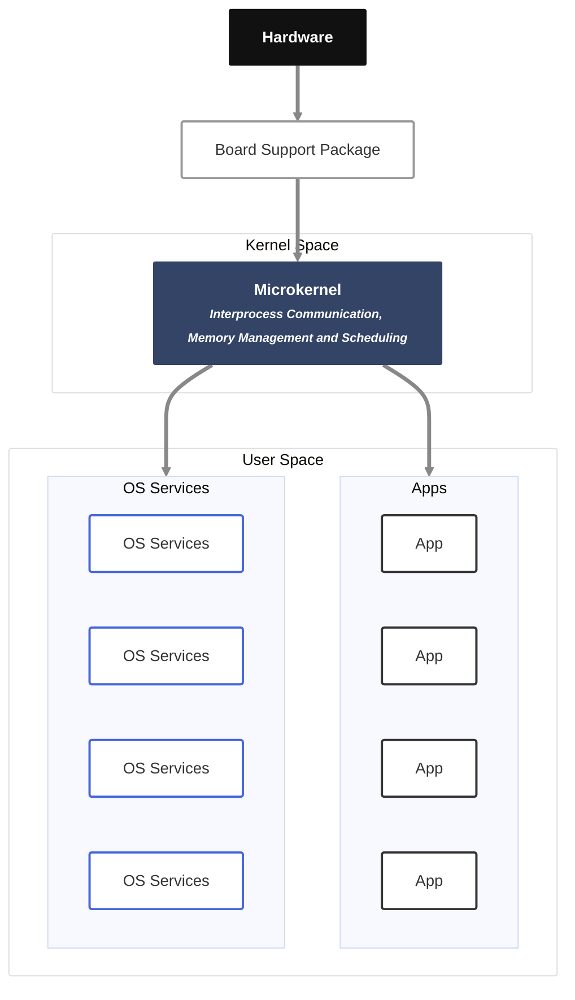

# QNX RTOS
Welcome to the QNX Crash Course. As an engineer, the most important thing to understand about QNX is that it is a Unix-like Real-Time Operating System (RTOS) built on a microkernel architecture, specifically designed for mission-critical and safety-critical environments.

## 1. Architecture: Microkernel vs. Monolithic
In a standard monolithic kernel (like Linux), services such as file systems, device drivers, and network stacks all run in the kernel address space. If one of those drivers malfunctions, it can crash the entire system.

QNX uses a microkernel approach, where only the most essential services reside in the kernel space. The central module is called procnto (a combination of the process manager and the Neutrino microkernel). Its responsibilities are strictly limited to:
* Thread services. 
* Scheduling services.
* Signal services.
* Message passing services.
* Synchronization services.
* Timers services.
* Process and Memory management.

Everything else—including device drivers, networking stacks, and file systems—runs in the user space as independent processes.

## 2. Resiliency and Hardware Protection
Because every driver and service runs in its own protected virtual memory space, the system gains massive resiliency.
Fault Isolation: If a serial driver crashes, only the serial port stops working; the kernel and other services remain functional.
Dynamic Recovery: You can restart or update a specific driver without rebooting the entire system.
Memory Protection: The virtual memory separation protects the kernel from being damaged by erratic or malicious user-space application behavior.

## 3. Hard Real-Time Behavior
QNX is a hard real-time OS, which is a strict requirement for fields like autonomous driving and medical robotics.
Determinism: It guarantees that high-priority threads will execute within a specific time window every single time.
Low Latency: The system is designed for high precision; missing a deadline is not an option in a hard real-time system, as it could be catastrophic.

## 4. The Logical Communication Bus (IPC)
Since services are isolated in different address spaces, they must communicate. QNX treats the microkernel as a logical communication bus.
Message Passing: Applications send requests to drivers through the kernel using IPC.
Overhead: This architecture introduces more context switching and data copying than monolithic systems. However, recent versions (like SDP 8.0) are highly optimized to be extremely fast to offset this.

## 5. Virtualization and the Hypervisor
Modern embedded hardware is becoming so powerful (e.g., 16 or 32 cores) that manufacturers are consolidating multiple systems onto one chip. This is where the QNX Hypervisor comes in:
Guest Isolation: It allows multiple operating systems (Guests)—like Android Automotive for infotainment and QNX for the safety-critical instrument cluster—to run on the same hardware without interfering with each other.
Resource Control: The hypervisor acts as the central authority, partitioning CPU cores and memory rooms for each virtual machine.
Mixed Criticality: It enables safety-certified and non-safety-certified code to coexist safely through temporal and spatial isolation.

## 6. Development Ecosystem
POSIX Compliance: QNX follows POSIX standards, meaning most standard Linux/Unix APIs (like pthreads or posix_spawn) work the same way, making code migration easy.
Tooling: Developers use the Software Development Platform (SDP), which includes the Momentics IDE (Eclipse-based) or extensions for VS Code.
Certifications: QNX is pre-certified to the highest safety integrity levels for automotive (ISO 26262 ASIL D), medical, and industrial standards.

## 7. QNX Software Architecture
The software architecture of the QNX kernel is based on a **microkernel design**, specifically optimized as a Real-Time Operating System (RTOS). Unlike monolithic architectures like Linux, where most OS services (file systems, drivers, etc.) run within the kernel's address space, QNX follows a minimalist approach by placing only the most critical functions inside the kernel space.

The following sections detail the core components and characteristics of this architecture:

### 7.1. The Microkernel (procnto)
The heart of the QNX system is the microkernel, often referred to as **procnto** (a combination of the process manager and the Neutrino kernel). To maintain a small footprint and high reliability, the kernel is restricted to essential services, including:
*   **Thread Services and Scheduling:** Managing how threads execute on CPU cores.
*   **Signal Management:** Handling signals between processes.
*   **Message Passing (IPC):** Facilitating communication between isolated processes.
*   **Synchronization and Timers:** Providing timing and coordination services.
*   **Process and Memory Management:** Handling process creation and virtual memory allocation.

### 7.2. User Space Isolation and Resiliency
In the QNX architecture, almost everything else—including **device drivers, network stacks, file systems, and graphics—runs outside kernel space** in the user space as separate, independent processes. 
*   **Memory Protection:** Each process runs in its own protected virtual memory space. This means that if a specific component, such as a serial driver, malfunctions or crashes, it does not impact the kernel or other running services.
*   **Modularity:** Because components are separate, they can be updated, restarted, or reconfigured individually without rebuilding the entire kernel or rebooting the system.
*   **Board Support Package (BSP):** Hardware-specific drivers (BSPs) also sit outside the kernel, making it easier to migrate the OS to different hardware architectures without changing the core kernel code.

### 7.3. Interprocess Communication (IPC)
Because OS services are isolated in separate address spaces, the microkernel acts as a **logical communication bus**. Processes communicate using IPC, which is the primary means for an application to request services from a driver or the kernel. While this isolation provides extreme reliability, it does introduce a trade-off: higher **context switching** and data copying overhead compared to monolithic kernels.

### 7.4. Hard Real-Time Capabilities
The QNX kernel is designed for **hard real-time behavior**, which is critical for safety-sensitive systems like autonomous vehicles or medical robots. 
*   **Determinism:** It guarantees that high-priority threads will be executed within a specific time window. 
*   **Predictability:** Unlike "soft" or "firm" real-time systems that may occasionally miss deadlines, a hard real-time OS like QNX ensures strict time guarantees.

### 7.5. Standards and Compatibility
*   **POSIX Compliance:** QNX is a Unix-like operating system that aligns with POSIX standards. This allows developers to use standard APIs, making it easier to port applications from Linux or FreeBSD.
*   **Security and Safety:** The architecture is designed for **mixed criticality**, allowing safety-certified and non-safety-certified code to run on the same system while remaining spatially and temporally isolated.

### 7.6. Comparison Summary
| Feature | Microkernel (QNX) | Monolithic (Linux) |
| :--- | :--- | :--- |
| **Kernel Space** | Minimal (IPC, Scheduling) | Extensive (Drivers, FS, Network) |
| **Resiliency** | High; component failure is isolated | Lower; component failure can crash the kernel |
| **Debugging** | Easier (User-space processes) | Difficult (Kernel-space complexity) |
| **Performance** | Context switching overhead | Faster due to direct address space |
| **Modularity** | Highly modular by design | Not modular; requires image rebuilds |

## 8. What is the role of procnto in the QNX architecture?
The module procnto (a combination of the process manager and the Neutrino microkernel) serves as the central authority and core of the QNX architecture. It is the piece of software responsible for all fundamental operating system services that must run in the kernel's protected address space.
The role of procnto can be broken down into two primary functional areas:
### 8.1. The Process Manager (proc)
The "proc" portion of the module handles the high-level management of processes and resources within the system. Its key responsibilities include:
* **Process Creation:** Managing the lifecycle of processes, such as handling fork requests.
* **Memory Management:** Handling memory allocation and managing the virtual memory separation that provides hardware protection and memory isolation between user-space applications.
* **Resource Ownership:** Managing process IDs (PIDs) and tracking the resources owned by each process, such as timers, file descriptors, and security contexts.
### 8.2. The Microkernel (nto)
The "nto" (Neutrino) portion provides the most essential, minimalist services required for a functioning RTOS. These include:
* **Thread Services:** Managing the execution of threads.
* **Interprocess Communication (IPC):** Acting as a logical communication bus. Because QNX drivers and file systems run in user space, procnto is the intermediary that allows these separate processes to exchange data and requests.
* **Scheduling and Timers:** Providing the deterministic, hard real-time scheduling necessary to ensure high-priority tasks meet their deadlines.
* **Signal Management and Synchronization:** Coordinating communication and state between threads using signals and synchronization primitives.
### 8.3. Strategic Significance in the Architecture
* **System Resiliency:** Because procnto contains only the "minimal" OS services, other components like networking stacks and device drivers are pushed into the user space. If a driver malfunctions or crashes, procnto remains unaffected, allowing the kernel to continue functioning and even restart the failed process.
* **The "Microkernel Approach":** Unlike monolithic kernels (like Linux) where drivers run inside the kernel space, procnto is designed to be as small as possible to reduce code complexity and improve reliability.
* **Hard Real-Time Performance:** The kernel is built to provide predictability and determinism. In recent versions (such as SDP 8.0), the kernel has been further optimized to be extremely fast to offset the context-switching overhead inherent in microkernel designs.
* **Hypervisor Foundation:** In virtualized environments, the QNX hypervisor acts as an extension of this microkernel architecture, using the same core concepts of security, performance, and reliability to manage multiple guest operating systems.

## 9. How does procnto handle messages through the logical communication bus?
In the QNX architecture, procnto (the combined process manager and microkernel) acts as the central hub or "bus master" for what is known as the logical communication bus. Because QNX is a microkernel system, most services—such as device drivers, file systems, and networking stacks—run in their own protected address spaces outside the kernel. Therefore, all communication between these isolated processes must be facilitated by the microkernel.
The handling of messages through this logical bus involves the following key mechanisms:
### 9.1. Interprocess Communication (IPC)
The logical communication bus is essentially the implementation of Interprocess Communication (IPC). When an application needs a service (for example, sending data through a serial port), it does not access the hardware directly; instead, it sends a message to the relevant driver through the kernel's IPC mechanism.
### 9.2. Role of the Microkernel (nto)
While the process manager (proc) handles process creation and memory management, the microkernel (nto) specifically provides the IPC services. Applications interact with the microkernel via kernel system calls to establish these IPC means or to manage threads.
### 9.3. Message Flow and Context Switching
When a message is sent across this logical bus:
* **Context Switching:** The system must perform a context switch from the sending process to the kernel, and then to the receiving process.
* **Data Copying:** To ensure security and isolation, the kernel may perform multiple data copies to move information between the different virtual memory spaces of the processes.
* **Blocking:** Typically, when a task sends data, it may enter a blocked state while waiting for a reply from the receiving process.
### 9.4. System Resiliency
By acting as the logical bus manager, procnto ensures that the failure of one component on the bus does not crash the entire system. If a specific driver malfunctions or overruns its memory, it only affects its own address space; procnto remains functioning and can continue to manage communication for other healthy drivers and applications.
To mitigate the performance overhead of constant context switching and data copying inherent in this "logical bus" design, recent versions of the kernel (such as SDP 8.0) have been optimized to be extremely fast.

## 10. What happens if a user-space driver crashes?
In the QNX microkernel architecture, when a user-space driver crashes, the system remains functional and the kernel itself does not crash. This is a fundamental advantage over monolithic architectures (like Linux), where a driver malfunction can crash the entire kernel or lead to a "blue screen of death".
The following details the specific outcomes and mechanisms triggered by a user-space driver crash:
### 10.1. Kernel and System Stability
Because device drivers (part of the Board Support Package or BSP) run in user space rather than kernel space, they are isolated in their own protected virtual memory addresses. If a driver, such as a serial driver, malfunctions or overruns its memory, it cannot corrupt or damage the kernel functionality. The microkernel continues to provide core services like scheduling and IPC for all other healthy processes.
### 10.2. Isolated Impact
A crash is contained specifically to the service provided by that driver. For example:
If a serial device driver fails, the serial port will stop functioning, but the network stack, file system, and user applications will remain intact and operational.
Other device drivers continue to work as usual because each is an independent process.
### 10.3. Immediate Recovery and Reconfiguration
One of the most powerful features of this architecture is the ability to restart or reconfigure a failed driver without a system reboot.
* **Granularity:** You have the control to switch off, switch on, or update a specific driver process independently.
* **Maintenance:** This modularity allows for easier maintenance and updates, as you only need to rebuild or restart the specific driver rather than the entire kernel image.
### 10.4. Resiliency and Reliability
This behavior is referred to as resiliency, which is a critical requirement for embedded applications like medical devices or autonomous vehicles where failure-free operation is mandatory. The QNX architecture is designed so that the "Sovereign Authority" (the kernel) always maintains control, even if a guest operating system or a specific user-space driver fails.

## 11. Comparison Summary

Feature | User-Space Driver (QNX) | Kernel-Space Driver (Monolithic)
--- | --- | ---
**Crash Result** | Only that specific service stops | The entire kernel and system crash
**Kernel Impact** | No impact; kernel remains functional | Total failure; system requires reboot
**Recovery** | Driver can be restarted in-place | Full image rebuild and/or reboot needed
**Debugging** | Easier; driver is a standard process | Difficult; debugging in kernel space is complex

## 12. How does the microkernel manage thread and IPC services?
The QNX microkernel (often referred to as procnto) manages thread and IPC services by acting as a minimalist, central authority that facilitates communication and execution for isolated user-space processes. While higher-level functions like file systems and drivers run in user space, the microkernel's core role is to provide the fundamental "plumbing" required for these components to interact safely.

### 12.1. Thread Management and Scheduling
The microkernel is responsible for the lifecycle and execution of threads, which are the basic units of execution in the system.
* **Kernel System Calls**: Applications do not manage threads directly; instead, they use kernel system calls to request the microkernel to create, manage, or synchronize threads.
* **Hard Real-Time Scheduling**: The microkernel manages CPU resources through deterministic scheduling. In a hard real-time environment, the kernel provides strict time guarantees, ensuring that a high-priority thread executes within its assigned time slice on a CPU core every single time.
* **Synchronization and Timers**: To prevent conflicts between threads, the microkernel handles synchronization primitives and provides timer services to coordinate time-sensitive tasks.

### 12.2. Interprocess Communication (IPC) Services
Because QNX isolates services in separate address spaces, the microkernel acts as a logical communication bus (or bus master) to move data between them.
* **Message Passing**: This is the primary IPC mechanism. When one process (like an application) needs a service from another (like a serial driver), it sends a message through the microkernel.
* **Context Switching and Data Copies**: Because processes are isolated for security, moving data involves context switching (switching the CPU's focus from the app to the kernel and then to the driver) and copying data between different virtual memory spaces.
* **Blocking Mechanism**: To ensure orderly communication, a task that sends data through the IPC bus typically enters a blocked state, meaning it pauses execution until it receives a reply from the receiving process.
* **Signal Management**: Beyond standard messages, the microkernel handles signals as a way to notify processes of specific events or states.

### 12.3. Resiliency and Performance
By limiting the kernel's role to these core thread and IPC services, the architecture achieves high reliability. If a user-space process (like a driver) fails, the microkernel remains functional because it is isolated from the crash, allowing it to continue managing communication for the rest of the system. To offset the performance cost of frequent context switching and data copying, recent versions of the kernel (such as SDP 8.0) have been highly optimized to execute these services extremely quickly

