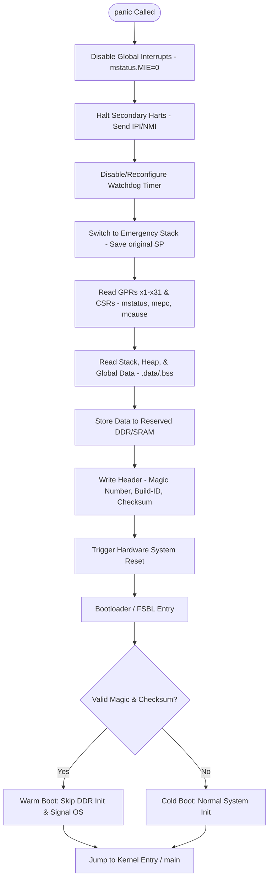

# RISC-V Crashdump System Design

## 1. Overview
The objective of the Crashdump system is to capture the processor state and critical memory regions immediately following an unrecoverable system error (e.g., Kernel Panic, Hardware Exception, or Watchdog Timeout). This data allows developers to perform post-mortem analysis to identify the root cause of the failure.

## 2. Triggering Mechanisms
The crashdump sequence is initiated by:
- **Synchronous Exceptions**: Hardware traps such as Instruction Page Faults, Illegal Instructions, or Load Alignment Faults.
- **Software Panics**: Explicit calls to `panic()` when the operating system detects an inconsistent state.
- **Watchdog Timer (WDT)**: A hardware-triggered reset where the "pre-reset" interrupt is used to capture state before the final reset occurs.

## 3. Data Capture Strategy

### 3.1 Register Context (CPU State)
For every Hart (core) in the system, the following must be captured:
- **General Purpose Registers (GPRs)**: x1 (ra) through x31 (t6). Note: x0 is always zero.
- **Control and Status Registers (CSRs)**:
    - `mstatus` / `sstatus`: Processor mode, interrupt enables, and memory protection state.
    - `mepc` / `sepc`: The program counter where the fault occurred.
    - `mcause` / `scause`: The numeric code indicating the reason for the trap.
    - `mtval` / `stval`: The faulting address or instruction bits.
    - `mscratch` / `sscratch`: To help identify the context during the trap.

### 3.2 Memory Snapshots
To keep the dump size manageable while maintaining utility, the following regions are prioritized:
- **Current Stack**: The stack frame belonging to the faulting thread (at least 4KB-8KB).
- **Global Data (.data / .bss)**: Critical system state variables.
- **Log Buffers**: The circular buffer containing the last set of system logs (`dmesg` or `printk` output).
- **Peripheral State**: Optional capture of critical hardware registers (e.g., Interrupt Controller status).

## 4. Storage and Persistence

### 4.1 Storage Options
| Strategy | Description | Persistence |
| :--- | :--- | :--- |
| **Reserved RAM** | A dedicated DDR region not used by the OS. | High (survives warm reset). |
| **Flash/NVRAM** | Writing the dump to non-volatile storage. | Very High (survives power cycle). |
| **UART/Streaming** | Streaming the binary data over a serial port. | Low (requires external capture). |

### 4.2 Warm Boot Preservation
On RISC-V systems, it is common to use a "Warm Boot" strategy where the DDR is not re-initialized by the Bootloader if a crash is detected. The Crashdump header is placed at a fixed physical address with a "Magic Number" to signal the bootloader to preserve the region.

## 5. Crashdump Format
The dump should follow a structured format for compatibility:
- **Header**: Magic number, version, timestamp, and Build-ID (to match the symbol file).
- **CPU Context Section**: Array of register sets for all active Harts.
- **Memory Map Section**: A list of descriptors (Address, Length, Type) followed by raw data.

*Recommendation*: Using a format compatible with `ELF` core dumps allows standard `gdb` to load the crashdump directly against a `vmlinux` or firmware binary.

## 6. Execution Flow (The "Panic" Path)
Before the system begins saving data, the entry point differs based on the trigger mechanism:

| Metric | Synchronous Exception | Software Panic | Watchdog (WDT) |
| :--- | :--- | :--- | :--- |
| **Trigger Source** | CPU Internal (e.g., Fault) | Kernel Code (e.g., `ASSERT`) | External Timer Hardware |
| **PC Precision** | **High**: Points to faulting instr | **Medium**: Points to `panic()` call | **Low**: Points to "point of hang" |
| **CSR Validity** | Hardware sets `mcause`/`mtval` | Manual/Software-defined codes | Captured via NMI/IRQ context |
| **Entry Path** | Hardware Trap Vector | Function Call / API | High-Priority Interrupt (NMI) |


1. **Halt Secondary Harts**: Send a Non-Maskable Interrupt (NMI) or Inter-Processor Interrupt (IPI) to stop other cores and freeze their state.
2. **Switch Stack**: Move to a dedicated "Emergency Stack" to avoid corrupting or overflowing the existing stack during dump generation.
3. **Save Context**: Store GPRs and CSRs into the reserved crash memory.
4. **Checksum**: Calculate a CRC32 or SHA-256 over the captured data to ensure integrity during the next boot.
5. **System Reset**: Trigger a hardware reset to return the system to a known good state.

## 7. Analysis Tooling
- **GDB**: Used for inspecting the call stack and variable values.
- **Scripts**: Custom Python scripts to decode `mcause` and `mtval` into human-readable descriptions based on the RISC-V Privileged Architecture Spec.
- **Crash Utility**: For Linux-based systems, ensuring the dump format is compatible with the `crash` tool.

## 8. Security Considerations
- **Sensitive Data**: Crashdumps may contain keys or user data. Consider encrypting the dump at rest using a public key stored in OTP (One-Time Programmable) memory.
- **Integrity**: Ensure the crash handler code itself is stored in a read-only section (Secure Boot) to prevent an attacker from redirecting the panic flow.

## 9. Panic Flow Diagram
The following diagram details the execution path when `panic()` is called, showing the transition from error detection to system restoration.



## 10. Multi-Layer Boot Crashdumps and Vector Relocation

In a complex SoC, the boot process is staged (e.g., Boot ROM -> First Stage Bootloader (FSBL) -> U-Boot -> OS). A system crash can happen at any of these stages, meaning the Crashdump system must be active from the very first instruction.

### 10.1. Layered Crashdump Handlers
- **Boot ROM Layer**: The Boot ROM is permanently burned into silicon. Its primary job is hardware initialization and loading the next stage. It has its own built-in crashdump routine. If a hardware fault happens here, the Boot ROM captures the state (usually to a dedicated SRAM or UART, since DDR might not be initialized yet).
- **Upper Boot Layers (FSBL/OS)**: Once the upper layer code is loaded into RAM (SRAM or DDR), it provides a much more sophisticated crash handler (e.g., it can write dumps to eMMC/Flash or over USB). 

### 10.2. Vector Relocation across Boot Layers
The critical mechanism to switch control from the Boot ROM's crash handler to the Upper Layer's crash handler is **Vector Relocation**.

When an exception occurs, the CPU jumps to a predefined memory address to execute the trap handler. 
* In **ARM Cortex-M**, this address is defined by the **VTOR** (Vector Table Offset Register).
* In **RISC-V**, this is defined by the **`mtvec`** (Machine Trap-Vector Base-Address Register) or **`stvec`** (Supervisor Trap-Vector Base-Address Register).

**The Relocation Flow:**
1. **Power On**: The CPU boots up. Hardware sets `mtvec` to the fixed physical address of the Boot ROM's trap vector table. Any crash routes to the ROM's minimal crashdump handler.
2. **Layer Handoff**: The Boot ROM verifies and loads the FSBL into memory. 
3. **Relocating Vectors**: Right before jumping to the FSBL's main execution point, the Boot ROM (or the FSBL's very first startup assembly code) writes the memory address of the FSBL's new vector table into the `mtvec` register:
   ```assembly
   la t0, fsbl_trap_vector_table
   csrw mtvec, t0
   ```
4. **New Crash Context**: From that exact CPU cycle onward, if a crash occurs, the CPU hardware will read `mtvec`, jump to the new `fsbl_trap_vector_table`, and execute the upper layer's advanced crashdump logic instead of the Boot ROM's.

By dynamically updating `mtvec` (or `stvec`) at every boot layer transition, the system seamlessly hands off exception handling and crashdump responsibility to increasingly capable software layers.
