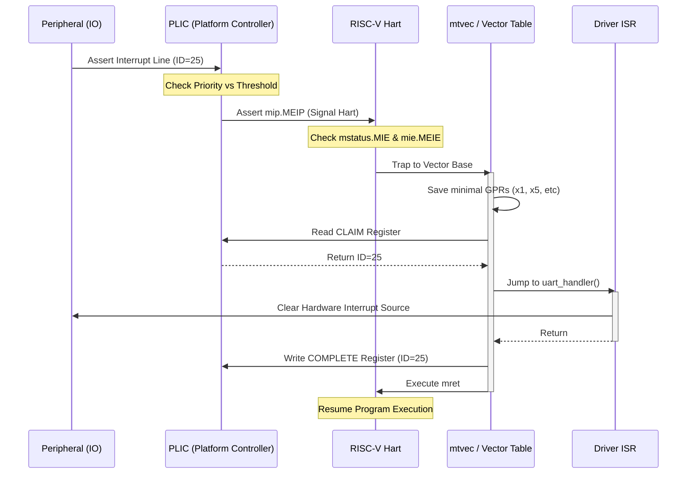

# RISC-V Architecture Deep Dive (RV32 ISA)

## 1. The Concept of a Hart (Hardware Thread)
A **Hart** is the fundamental unit of execution in the RISC-V specification. It stands for **Hardware Thread**.

### 1.1 Definition
A hart is an entity that contains a full architectural state (registers, PC, and CSRs) and independently fetches and executes instructions.

### 1.2 Applicability to Microcontrollers
Yes, the term "Hart" is directly applicable to microcontrollers:
- **Single-Core MCUs**: Usually contain exactly one hart. In this context, "Core" and "Hart" are often used interchangeably.
- **Multi-Core MCUs**: A chip with two physical cores has two harts.
- **Multi-Threaded Cores (SMT)**: High-performance RISC-V cores might implement Simultaneous Multithreading. If a single physical core can maintain two independent sets of register states and execute two instruction streams simultaneously, it contains **two harts**.

## 2. The RV32I Register File
The base integer ISA (RV32I) provides 32 general-purpose registers (x0-x31), each 32 bits wide.

| Register | ABI Name | Role | Saver |
| :--- | :--- | :--- | :--- |
| **x0** | `zero` | Hardwired Zero | -- |
| **x1** | `ra` | Return Address | Caller |
| **x2** | `sp` | Stack Pointer | Callee |
| **x3** | `gp` | Global Pointer | -- |
| **x4** | `tp` | Thread Pointer | -- |
| **x5-x7** | `t0-t2` | Temporaries | Caller |
| **x8** | `s0`/`fp` | Saved Register / Frame Pointer | Callee |
| **x9** | `s1` | Saved Register | Callee |
| **x10-x11** | `a0-a1` | Function Args / Return Values | Caller |
| **x12-x17** | `a2-a7` | Function Arguments | Caller |
| **x18-x27** | `s2-s11` | Saved Registers | Callee |
| **x28-x31** | `t3-t6` | Temporaries | Caller |

## 2.1. The Global Pointer (`gp`) Register
The **Global Pointer (x3)** is an optimization used by compilers and linkers to reduce code size and increase execution speed when accessing global variables.

### 2.1.1. The Problem
Loading a 32-bit address in RISC-V usually requires two instructions because instructions themselves are only 32 bits:
1. `lui` (Load Upper Immediate): Sets bits 12-31.
2. `lw` or `addi`: Sets bits 0-11.

### 2.1.2. The `gp` Solution
The linker identifies "small" global variables (those in `.sdata` or `.sbss`) and places them within a 4KB range. It then initializes the `gp` register to the center of this range during startup (CRT0).

Because the `lw` (load word) instruction supports a 12-bit signed offset ($\pm$2048 bytes), the CPU can access any variable in that 4KB range using a **single instruction** relative to `gp`:
```assembly
# Accessing a global 'my_var' WITHOUT gp (2 instructions)
lui  a0, %hi(my_var)
lw   a0, %lo(my_var)(a0)

# Accessing a global 'my_var' WITH gp (1 instruction)
lw   a0, %pcrel_lo(label)(gp)
```
This process is known as **Linker Relaxation**.

## 2.2. The Thread pointer (`tp`) Register
The Thread Pointer (`x4`/`tp`) is a dedicated register used to point to thread-local storage (TLS) or thread-specific data.

### 2.2.1. Purpose
In multi-threaded environments, each thread often needs its own private copy of certain global or static variables. TLS provides a mechanism for this, allowing each thread to access its own instance of a variable using the same symbolic name. The `tp` register is typically initialized by the operating system or runtime environment during thread creation to point to the base address of the current thread's TLS area.

### 2.2.2. Usage
Compilers generate code that accesses thread-local variables using an offset from the `tp` register. This allows for efficient access to thread-specific data without requiring complex lookups or function calls.
```assembly
# Accessing a thread-local variable 'my_thread_var'
lw a0, %tprel_lo(my_thread_var)(tp)
```
This approach simplifies thread-safe programming and improves performance by making thread-local data access as fast as accessing a global variable.


## 4. Instruction Formats
RISC-V uses a very clean, fixed-length (32-bit) instruction encoding. There are 6 primary formats:

- **R-type**: Register-Register operations (e.g., `add`, `sub`).
- **I-type**: Register-Immediate operations, Loads (e.g., `addi`, `lw`).
- **S-type**: Stores (e.g., `sw`, `sb`).
- **B-type**: Conditional Branches (e.g., `beq`, `bne`).
- **U-type**: Upper Immediates (e.g., `lui`, `auipc`).
- **J-type**: Unconditional Jumps (e.g., `jal`).

## 5. Code Generation Patterns

### 5.1 Function Prologue and Epilogue
When a function starts, it must preserve "Callee-saved" registers if it intends to use them.

```assembly
func_name:
    # Prologue
    addi sp, sp, -16    # Allocate stack space
    sw   ra, 12(sp)     # Save return address
    sw   s0, 8(sp)      # Save frame pointer
    addi s0, sp, 16     # Set new frame pointer

    # ... Function Body ...

    # Epilogue
    lw   ra, 12(sp)     # Restore RA
    lw   s0, 8(sp)      # Restore FP
    addi sp, sp, 16     # Deallocate stack
    ret                 # Return (jr ra)
```

### 5.2 Control Flow: If-Else
RISC-V does not have conditional execution (like ARM's `ADDEQ`). It uses comparison and branching.

C Code:
```c
if (a == b) {
    c = 1;
} else {
    c = 2;
}
```

Generated Assembly (RV32):
```assembly
    bne a0, a1, else_block  # Branch if a != b
    li  a2, 1               # c = 1
    j   end_if
else_block:
    li  a2, 2               # c = 2
end_if:
```

### 5.3 Function Calls (Standard ABI)
To call a function `void foo(int x, int y)`, the arguments are placed in `a0` and `a1`.

```assembly
li   a0, 10      # Arg 0
li   a1, 20      # Arg 1
jal  ra, foo     # Jump and Link (saves PC+4 into ra)
```

### 5.4 Accessing Memory (Load/Store)
RISC-V is a strict Load/Store architecture. Arithmetic only happens on registers.

```assembly
la   t0, my_array    # Load address of array
lw   t1, 0(t0)       # Load first word into t1
addi t1, t1, 5       # Add 5 to the value
sw   t1, 4(t0)       # Store result into second word of array
```

## 6. Privilege Levels
RISC-V defines three standard privilege levels to provide hardware-enforced isolation:

1. **User Mode (U-mode)**: Lowest privilege. Restricted access to CSRs and memory. Used for application code.
2. **Supervisor Mode (S-mode)**: Used by Operating Systems (Linux/KVM). Manages virtual memory (MMU).
3. **Machine Mode (M-mode)**: Highest privilege. Mandatory for all RISC-V systems. Handles physical interrupts and low-level hardware configuration (like the Crashdump system).

## 7. Memory Model: Fences
RISC-V uses a **Relaxed Memory Model**. This means that the order of loads and stores seen by one hart might differ from the order seen by another. To enforce ordering (crucial for drivers and IPC), the `fence` instruction is used.

```assembly
sw    t0, 0(a1)      # Data write
fence w, w           # Ensure data is visible before signaling flag
sw    t1, 0(a2)      # Signal flag
```

## 8. Physical Memory Protection (PMP)
PMP is the RISC-V equivalent of an MPU (Memory Protection Unit) for Machine Mode.

### 8.1 Configuration
PMP allows M-mode to grant or deny U-mode/S-mode access to specific physical address ranges.
- **Registers**: `pmpcfg0`-`pmpcfg15` and `pmpaddr0`-`pmpaddr63`.
- **Modes**:
    - **OFF**: Disabled.
    - **TOR**: Top of Range (uses the current and previous address register).
    - **NA4**: Naturally Aligned 4-byte.
    - **NAPOT**: Naturally Aligned Power-of-Two.

### 8.2 Locking
If a PMP entry is "Locked" (L-bit set), the permissions apply even to M-mode, providing a way to protect security-critical code from M-mode software bugs.

## 9. Compressed Instructions (The 'C' Extension)
In embedded systems, memory footprint is critical. The `RVC` extension provides 16-bit forms of common instructions.

### 9.1 Mechanics
- Every 16-bit compressed instruction has a direct 32-bit equivalent.
- The CPU decoder expands these to 32-bit internally.
- **Alignment**: When RVC is present, instructions can be aligned to 2-byte boundaries instead of 4-byte boundaries.

### 9.2 Code Density Impact
Typically, RVC reduces binary size by **25%-30%**, making it competitive with ARM's Thumb-2.

## 10. Atomic Memory Operations (The 'A' Extension)
For multi-hart synchronization, RISC-V provides two types of atomic operations.

### 10.1 Load-Reserved / Store-Conditional (LR/SC)
Used to implement complex atomic primitives (like Compare-and-Swap).
```assembly
lr.w t0, (a0)        # Load value from a0 and register a reservation
addi t0, t0, 1       # Increment
sc.w t1, t0, (a0)    # Store if reservation is still valid (t1=0 on success)
bnez t1, retry_label # If t1 != 0, reservation was lost, retry
```

### 10.2 AMO (Atomic Memory Operations)
Single-instruction operations that perform a read-modify-write in the memory controller or cache.
- `amoadd.w`: Atomic addition.
- `amoswap.w`: Atomic swap.
- `amoxor.w`: Atomic XOR.

## 11. Interrupt Architecture
RISC-V handles interrupts differently than ARM's GIC. It typically uses a combination of local and platform-level controllers.

### 11.1 CLINT (Core Local Interruptor)
Handles software interrupts and timer interrupts for each Hart.
- `mtime`: A 64-bit real-time counter.
- `mtimecmp`: Used to generate a timer interrupt when `mtime >= mtimecmp`.

### 11.2 PLIC (Platform-Level Interrupt Controller)
Prioritizes and routes external interrupts to specific Harts.
- **Claim/Complete Process**: A Hart "claims" an interrupt by reading a memory-mapped register, which provides the ID of the highest-priority pending interrupt. After handling, it writes the ID back to the "complete" register.

### 11.3 Interrupt Entry
The `mcause` register's most significant bit (MSB) distinguishes between **exceptions** (0) and **interrupts** (1).

## 12. Advanced Interrupt Handling & Modes

RISC-V supports different "modes" of handling interrupts, defined primarily by the `mtvec` (Machine Trap-Vector Base-Address Register).

### 12.1 Handling "Without a Controller" (Direct Mode)
In basic configurations (Mode 0), all synchronous exceptions and asynchronous interrupts jump to the **same address** stored in `mtvec`.
- **Logic**: The software must read `mcause` to determine if it's a timer, software, or external interrupt and then branch manually.
- **Performance**: Higher latency due to software dispatching.

### 12.2 Handling "With a Controller" (Vectored Mode)
In Mode 1, interrupts jump to `Base + (4 * cause)`.
- **Logic**: Each interrupt source has a dedicated entry in a jump table.
- **Performance**: Faster dispatching; resembles the "Auto-vectoring" found in traditional microcontrollers.

### 12.3 CLIC (Core-Local Interrupt Controller) - The NVIC Equivalent
For high-performance microcontrollers, the **CLIC** replaces the basic CLINT/PLIC logic.
- **Preemption**: Supports hardware-based nested interrupts (hardware stack tracking).
- **Prioritization**: Supports up to 256 priority levels.
- **Vectored Hardware**: Directly fetches the ISR address from memory, reducing software overhead to near-zero.

## 13. NMI (Non-Maskable Interrupt) vs. Normal Interrupts

| Feature | Normal Interrupt | NMI (Non-Maskable) |
| :--- | :--- | :--- |
| **Masking** | Controlled by `mstatus.MIE` | **Cannot be masked** by software. |
| **Trigger** | Peripherals, Timers, Software | Critical Hardware Failure (ECC, Watchdog). |
| **Entry Point** | Defined by `mtvec`. | Often a **fixed hardware address** or dedicated NMI vector. |
| **Context** | Standard trap flow. | Special "Resume" instructions might be needed if it can interrupt M-mode itself. |

## 14. Interrupt Propagation Flow: IO to ISR

In a complex SoC (like Qualcomm Snapdragon), interrupts typically flow through a hierarchy (PLIC for platform level, CLINT/CLIC for core level).

### 14.1 The Standard PLIC Flow (Legacy/Large Systems)
1.  **I/O Trigger**: A peripheral (e.g., UART) asserts an interrupt line.
2.  **PLIC Latch**: The Platform-Level Interrupt Controller sees the line high and sets a "Pending" bit for that ID.
3.  **Priority Check**: PLIC compares the interrupt's priority against the Hart's "Threshold" register.
4.  **Notification**: If priority > threshold, PLIC asserts the `meip` (Machine External Interrupt Pending) signal to the specific Hart.
5.  **Hart Arbitration**: The Hart checks its `mstatus.MIE` (Global Enable) and `mie.MEIE` (External Enable).
6.  **Trap**: The Hart stops execution, saves the current PC into `mepc`, sets `mcause`, and jumps to `mtvec`.
7.  **Claim**: The software ISR entry code reads the **PLIC Claim Register**. This returns the ID of the highest priority pending interrupt and atomically clears the pending bit.
8.  **ISR Execution**: Software uses the ID to index a function pointer table and executes the actual driver code.
9.  **Complete**: Software writes the ID back to the **PLIC Complete Register** to signal the PLIC that the interrupt is handled.
10. **Return**: Execution of `mret` restores the PC from `mepc`.

### 14.2 The Fast CLIC Flow (Low-Latency / MCU)
1.  **I/O Trigger**: Peripheral asserts line.
2.  **CLIC Arbitration**: CLIC immediately determines if the new interrupt has higher priority than the currently executing code.
3.  **Hardware Vectoring**: CLIC pushes minimal state to the stack (if configured) and fetches the ISR address directly from the vector table.
4.  **ISR Execution**: The CPU jumps straight to the driver code without a generic "Trap Handler" middleman.

## 15. Full Interrupt Path Diagram


